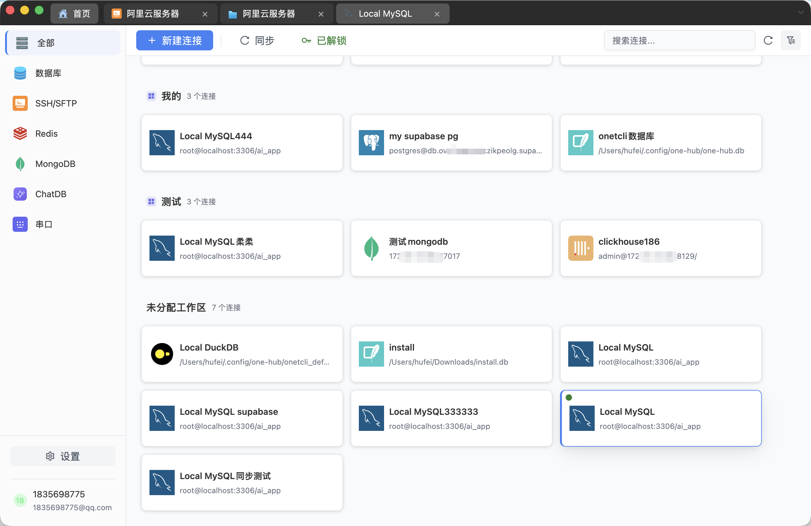
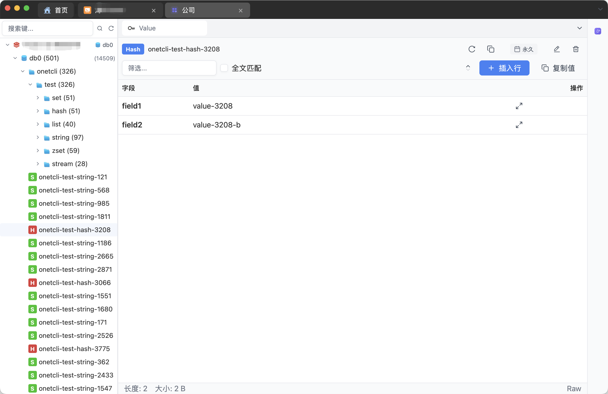
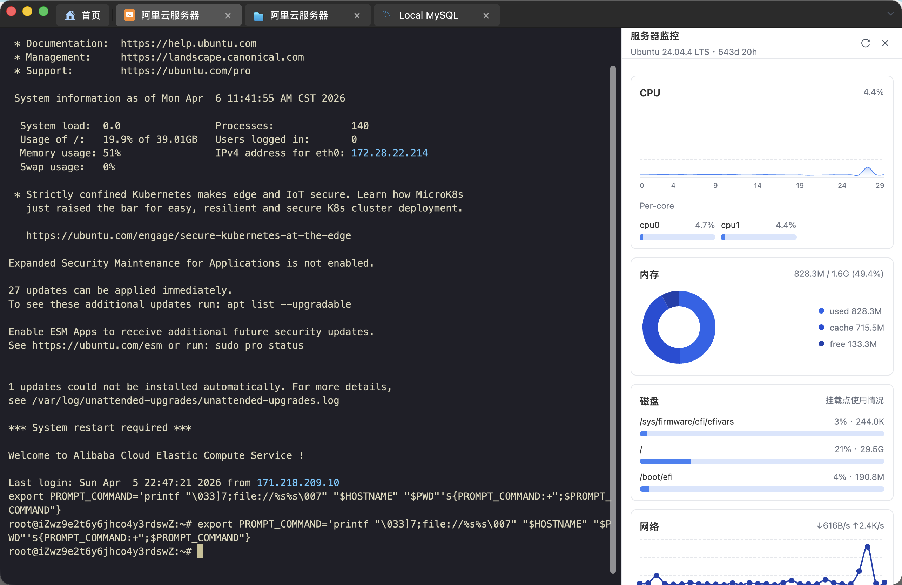
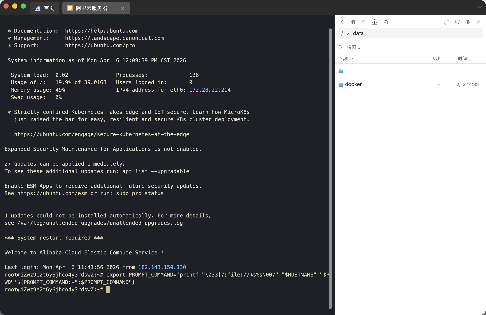
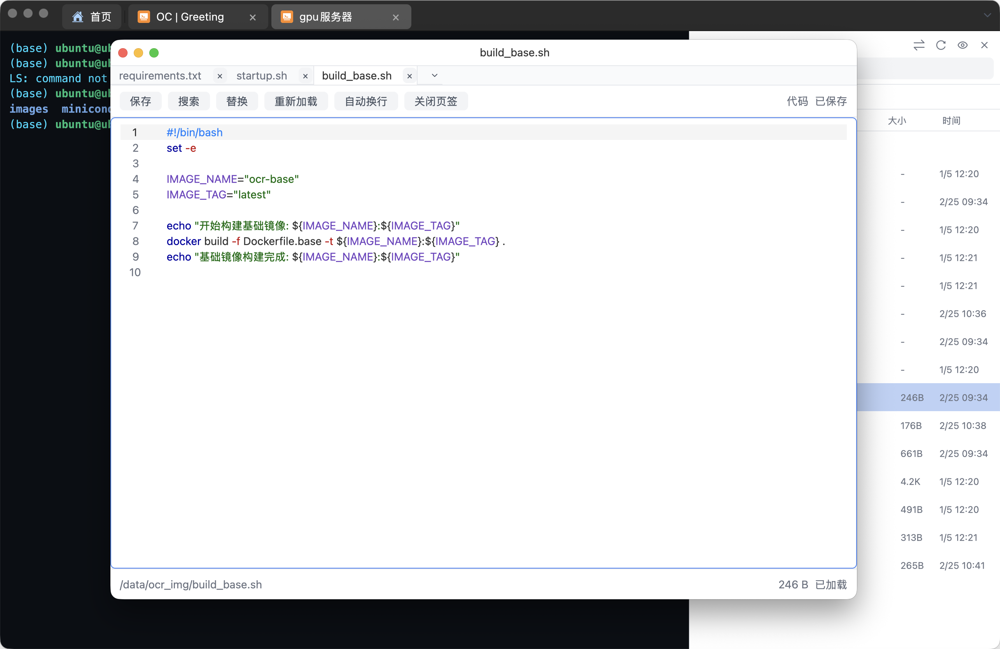

<div align="center">
  <p>
    
  </p>

  <h1>OmniHub</h1>

  <p><strong>Native all-in-one workspace for databases, SSH, SFTP, terminals, monitoring, and AI.</strong></p>

  <p>
    Built with <a href="https://gpui.rs">GPUI</a> · Rust native desktop · GPU-accelerated rendering
  </p>

  <p>
    <a href="https://github.com/feigeCode/onetcli/releases"></a>
    <a href="https://github.com/feigeCode/onetcli/actions/workflows/ci.yml"></a>
    <a href="LICENSE-APACHE"></a>
    <a href="https://qm.qq.com/cgi-bin/qm/qr?k=&group_code=860670605"></a>
    <a href="https://docs.qq.com/doc/DVEFFd2RnSnJLcFBD"></a>
  </p>

  <p>
    
    
    
    
    
    
    
    
    
    
    
  </p>

  <p>
    <a href="README_CN.md">中文</a> ·
    <a href="#install">Install</a> ·
    <a href="https://github.com/feigeCode/onetcli/releases/latest">Latest Release</a> ·
    <a href="#features">Features</a> ·
    <a href="#screenshots">Screenshots</a> ·
    <a href="CONTRIBUTING.md">Contributing</a>
  </p>

  <p>
    
  </p>
</div>

## Why OmniHub?

<table>
  <tr>
    <td width="50%">
      <h3>Native desktop, not a browser shell</h3>
      <p>OmniHub is built with Rust and GPUI for a native desktop experience with GPU-accelerated rendering.</p>
    </td>
    <td width="50%">
      <h3>One workspace for daily ops</h3>
      <p>Database management, SSH terminals, SFTP file transfer, serial connections, and local terminals live in one app.</p>
    </td>
  </tr>
  <tr>
    <td>
      <h3>AI next to your data</h3>
      <p>Use the built-in AI assistant for natural language to SQL, query explanation, BI-style analysis, and chart generation.</p>
    </td>
    <td>
      <h3>Remote work without context switching</h3>
      <p>Open a remote terminal, browse files through SFTP, drag files into the sidebar, and edit remote files with syntax highlighting.</p>
    </td>
  </tr>
</table>

## Features

### Database Workspace

Connect to MySQL, PostgreSQL, SQLite, DuckDB, SQL Server, Oracle, and ClickHouse from a single interface. Browse schemas, tables, columns, indexes, foreign keys, procedures, functions, triggers, and sequences where supported.

### External Database Drivers

Extend database support beyond the built-in engines via external IPC drivers. Drop in a driver package (manifest + binary) and OmniHub loads it through a versioned protocol with manifest schema validation. Third-party drivers can be discovered through the marketplace.

### SQL Editor & Schema Tools

Work with a SQL editor backed by syntax tooling, schema-aware browsing, table structure editing, query execution, explain support, and ER diagrams.

### Redis & MongoDB

Use the dedicated Redis viewer for key browsing, value inspection, and cluster connections. Explore MongoDB collections, inspect documents, and run queries from the same workspace.

### SSH, SFTP, Serial & Terminal

Open integrated SSH sessions, manage SFTP files, connect to serial devices, and keep local terminals in multi-tab sessions. The terminal includes an SFTP sidebar with drag-and-drop upload support, path favorites, and quick jumps to frequently used directories.

### Port Forwarding

Run local port forwarding and dynamic SOCKS forwarding without leaving the app. Tunnel remote services to localhost for debugging or route traffic through SSH, with multi-rule management in a dedicated view.

### Remote File Editing

Edit remote files directly inside OmniHub with syntax highlighting and autocomplete. No need to open another editor or switch back and forth between terminal and file tools.

### Remote Desktop

Connect to any VNC-compatible server (including macOS Screen Sharing / ARD) with selectable display modes (Contain / Original / Cover / Fill) and real-time keyboard and mouse forwarding. Providers are installed on demand via a marketplace with SHA-256 verification and rollback.

### Monitoring & Charts

Use built-in server monitoring and native rendered charts to inspect remote machine status and data analysis output.

### AI Assistant

Chat with AI inside the app. OmniHub supports natural language to SQL, query explanation, BI-style data analysis, chart generation, and streaming LLM responses. It can also generate terminal commands that you can quickly paste into a terminal session and run.

### Sync, Security & i18n

Sync connections and settings across devices with encrypted key storage based on AES-GCM and Ed25519. OmniHub supports light and dark themes, English, Simplified Chinese, and Traditional Chinese.

## Screenshots

| Database | SSH |
|:-:|:-:|
| [](database.png) | [](ssh.png) |

| SFTP | Redis |
|:-:|:-:|
| [](sftp.png) | [](redis.png) |

| MongoDB | AI Chat |
|:-:|:-:|
| [](mongodb.png) | [](chatdb.png) |

| Monitoring | SFTP Sidebar |
|:-:|:-:|
| [](monitor.png) | [](sftp_sidebar.png) |

| Remote File Editor | ER Diagram |
|:-:|:-:|
| [](remote_file_editor.png) | [](er.png) |

## Install

Download the latest build from the [Releases](https://github.com/feigeCode/onetcli/releases/latest) page.

Release artifacts are currently published by platform:

| Platform | Architecture | Artifact |
|----------|--------------|----------|
| macOS | Apple Silicon, Intel | `.dmg`, `.tar.gz` |
| Linux | x86_64 | `.tar.gz` |
| Windows | x86_64 | `.zip` |

Checksums are published as `sha256sums.txt` in each release.

### macOS Gatekeeper

If macOS blocks the app after installing the DMG with "Apple cannot check it for malicious software", run:

```bash
sudo xattr -rd com.apple.quarantine /Applications/OmniHub.app
```

### Oracle Support

Oracle connections require [Oracle Instant Client](https://www.oracle.com/database/technologies/instant-client/downloads.html) (Basic package). Download the version matching your platform and ensure the libraries are in your library search path.

## Getting Started

1. Open OmniHub and create your first database connection.
2. Add an SSH host and open a remote terminal.
3. Open SFTP file management to browse remote directories or transfer files.
4. Try Redis key browsing or MongoDB document browsing.
5. Use the AI assistant in SQL or data analysis workflows.

## Build From Source

### Prerequisites

- Rust 2024 edition
- Platform-specific system dependencies

### System Dependencies

**macOS / Linux:**

```bash
./script/bootstrap
```

**Windows (PowerShell):**

```powershell
.\script\install-window.ps1
```

### Run

```bash
cargo run -p main
```

### Development Checks

```bash
# Build
cargo build

# Test
cargo test --all

# Lint
cargo clippy --workspace --all-targets

# Format check
cargo fmt --check
```

### Focused Verification

在做入口、核心 crate 或同步服务相关改动时，优先运行最小主路径验证，再视影响面扩大：

```bash
# Rust main path
cargo check -p main
cargo check -p one-core
cargo check -p terminal_view

# Targeted regression tests
cargo test -p main
cargo test -p gpui-component

# sync_server
cd sync_server && npm run check
```

See [CONTRIBUTING.md](CONTRIBUTING.md) for the full development guide.

## Tech Stack

| Category | Technologies |
|----------|--------------|
| UI Framework | [GPUI](https://gpui.rs) |
| Language | Rust |
| Databases | tokio-postgres, mysql_async, rusqlite, tiberius, oracle, clickhouse |
| Redis / MongoDB | redis, mongodb |
| SSH / SFTP | russh, russh-sftp |
| Terminal | alacritty_terminal |
| Text Editing | ropey, tree-sitter, sqlparser |
| AI | llm-connector |
| Encryption | aes-gcm, sha2, ed25519 |
| i18n | rust-i18n |

## FAQ

<details>
<summary><strong>Which databases are supported?</strong></summary>

OmniHub has built-in database support for MySQL, PostgreSQL, SQLite, DuckDB, SQL Server, Oracle, and ClickHouse. It also includes dedicated Redis and MongoDB views.
</details>

<details>
<summary><strong>Does Oracle need extra setup?</strong></summary>

Yes. Oracle connections require Oracle Instant Client to be installed and available through your system library search path.
</details>

<details>
<summary><strong>Where can I download OmniHub?</strong></summary>

Use the GitHub [Releases](https://github.com/feigeCode/onetcli/releases/latest) page. The current release workflow publishes macOS, Linux, and Windows artifacts with checksums.
</details>

<details>
<summary><strong>Is OmniHub free?</strong></summary>

All features are available without sponsorship. The source is licensed under Apache License 2.0, and distribution or product use is also subject to the OmniHub Supplementary License.
</details>

<details>
<summary><strong>How do I report bugs or request features?</strong></summary>

Open an issue on [GitHub Issues](https://github.com/feigeCode/onetcli/issues). For code changes, please read [CONTRIBUTING.md](CONTRIBUTING.md) first.
</details>

## Support

OmniHub is maintained by one person over the long term. If it saves you time, you can support the project through donations, stars, bug reports, or focused pull requests.

### Donation

Donation is optional and does not unlock or restrict any features. See [DONATE.md](DONATE.md) for WeChat Pay, Alipay, and PayPal options.

### Community Contacts

Official community channels:

- QQ Group: [860670605](https://qm.qq.com/cgi-bin/qm/qr?k=&group_code=860670605)
- WeChat Group: [Join](https://docs.qq.com/doc/DVEFFd2RnSnJLcFBD)

## Credits

ER diagram rendering is based on [ferrum-flow](https://github.com/tu6ge/ferrum-flow.git).

## License

Licensed under [Apache License 2.0](LICENSE-APACHE).

The distribution and use of the OmniHub application are additionally subject to the [OmniHub Supplementary License](OMNIHUB_LICENSE), which adds the following restrictions on top of Apache 2.0:

- No redistribution, resale, or repackaging as a standalone product
- No creating competing products or services based on this software
- No hosting on unauthorized distribution platforms

For licensing inquiries, contact xiaofei.hf@gmail.com.

## Star History

<a href="https://www.star-history.com/?repos=feigeCode%2Fomnihub&type=date&logscale=&legend=top-left">
 <picture>
   <source media="(prefers-color-scheme: dark)" srcset="https://api.star-history.com/chart?repos=feigeCode/onetcli&type=date&theme=dark&logscale&legend=top-left" />
   <source media="(prefers-color-scheme: light)" srcset="https://api.star-history.com/chart?repos=feigeCode/onetcli&type=date&logscale&legend=top-left" />
   
 </picture>
</a>
